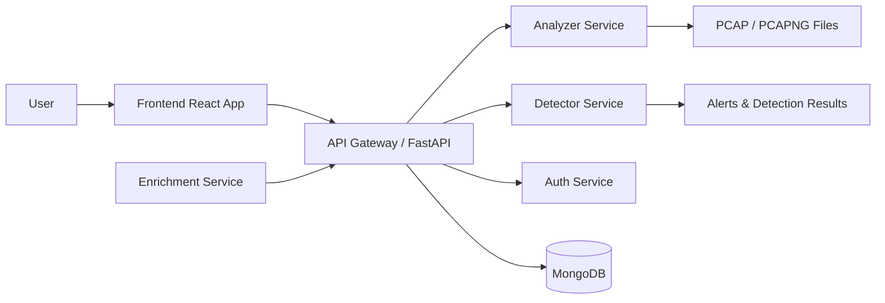

# Network Anomaly Detection Platform

This project is a full-stack network traffic analysis and anomaly detection system designed to detect suspicious communication patterns from PCAP files and present the results through a web interface. It combines packet extraction, protocol-based aggregation, rule-based detection, alert generation, authentication, and a dashboard for monitoring security events.

## Project objective

The main objective of this project is to build an intelligent monitoring system capable of:

- capturing and analyzing network traffic from PCAP/PCAPNG files,
- extracting relevant metadata for protocols such as TCP, UDP, DNS, HTTP, ICMP, and TLS,
- aggregating traffic statistics over time windows,
- detecting abnormal behaviors based on network rules,
- storing results and alerts,
- exposing the system through a web application and REST API,
- allowing authenticated users to manage and consult analyses.

This system is relevant for network monitoring, intrusion detection, and cybersecurity analysis in a modern and modular architecture.

---

## Main features

- Packet extraction using TShark and Python-based parsing
- Traffic aggregation at global and per-protocol levels
- Temporal window analysis for detecting patterns over time
- TCP handshake tracking to identify incomplete or suspicious sessions
- Rule-based detector for abnormal behaviors and suspicious traffic
- Structured JSON alert output for each analysis
- Backend APIs for analysis and authentication
- MongoDB persistence for analysis and authentication data
- Frontend dashboard to visualize alerts and results
- Docker-based deployment for all services

---

## System architecture



The architecture is modular and based on independent services:

- Analyzer: packet parsing and extraction
- Detector: anomaly detection rules
- Enrichment: data enrichment and contextualization
- API Gateway: central access layer
- Auth Service: user authentication and authorization
- Frontend: web interface for users
- MongoDB: persistent storage for results and profiles

---

## Technologies used

### Backend
- Python
- FastAPI
- PyShark
- MongoDB
- Pydantic
- Docker

### Frontend
- React
- Vite
- JavaScript / JSX
- Express (for server rendering / production serving)

### Infrastructure
- Docker Compose
- Kubernetes manifests in the k8s folder

---

## Project structure

```text
anomalydetection/
├── backend/
│   ├── app/
│   │   ├── analyzer/
│   │   │   ├── extractor.py
│   │   │   ├── aggregator.py
│   │   │   ├── models.py
│   │   │   └── main.py
│   │   ├── api/
│   │   │   ├── main.py
│   │   │   ├── storage.py
│   │   │   └── schemas.py
│   │   ├── auth/
│   │   │   ├── main.py
│   │   │   ├── routes.py
│   │   │   ├── security.py
│   │   │   └── models.py
│   │   ├── detector/
│   │   │   ├── engine.py
│   │   │   ├── alert.py
│   │   │   └── rules/
│   │   ├── enrichment/
│   │   └── main.py
│   ├── samples/
│   ├── tests/
│   ├── requirements.txt
│   └── README.md
├── frontend/
│   ├── src/
│   ├── package.json
│   ├── vite.config.js
│   └── server.js
├── k8s/
├── docker-compose.yml
├── requirements.txt
├── .gitignore
├── README.md
└── scripts/
```

---

## Workflow of the system

1. The user uploads or selects a PCAP file.
2. The analyzer extracts packets and protocol metadata.
3. Data is aggregated by protocol and time window.
4. The detector applies rules to identify suspicious behavior.
5. Alerts are generated with severity levels, evidence, and metadata.
6. Results are stored in MongoDB and exposed through APIs.
7. The frontend displays the analysis and alert information to the user.

---

## Detection logic

The project detects abnormal patterns such as:

- incomplete TCP handshakes,
- unusual or suspicious port activity,
- DNS anomalies,
- HTTP errors and abnormal requests,
- ICMP flood-like activity,
- TLS interruptions,
- malformed or risky network conversations.

Detection is performed using rule-based evaluation over structured traffic conversations generated by the analyzer. This allows the system to produce meaningful alerts instead of only raw packet summaries.

---

## Installation and setup

### Prerequisites

- Python 3.10+
- Node.js and npm
- Docker and Docker Compose
- TShark (required for packet extraction)

### Option 1: Run with Docker

```bash
docker compose up --build
```

This starts:

- MongoDB
- API gateway
- Analyzer service
- Detector service
- Enrichment service
- Auth service
- Frontend

### Option 2: Local development setup

```bash
# Backend
python -m venv .venv
source .venv/bin/activate   # On Windows: .venv\Scripts\activate
pip install -r backend/requirements.txt

# Frontend
cd frontend
npm install
npm run dev
```

> Note: TShark must be installed and accessible from the system PATH so the packet extractor can read .pcap files correctly.

---

## Usage

### Run the backend analysis from a PCAP file

```bash
cd backend
python -m app.main samples/test_ids.pcap
```

This produces a detection result JSON and saves the output in the alerts directory.

### Run the frontend

```bash
cd frontend
npm run dev
```

Then open the application in the browser and login or use the available dashboard flows.

---

## API overview

The project exposes several FastAPI services:

- API Gateway: main entry point for analysis and dashboard operations
- Auth Service: login, registration, and token handling
- Analyzer Service: packet extraction and aggregation
- Detector Service: rule-based detection
- Enrichment Service: enrichment for detected events

Main endpoints include:

- /login
- /register
- /analyses
- /analyses/{analysis_id}
- /analyses/{analysis_id}/alerts

---

## Persistent data

MongoDB is used for storing:

- user data,
- authentication records,
- analysis metadata,
- alerts,
- enriched detection results.

This makes the platform suitable for multi-user monitoring and longer-term reporting.

---

## Report-oriented summary

This project presents a complete pipeline for network anomaly detection based on packet analysis and intelligent rule evaluation. It demonstrates how network data can be transformed into structured security information and then exposed through a modern interface. The system combines network forensics, protocol analysis, backend services, and visualization, providing a practical foundation for real-world intrusion detection and monitoring systems.

---

## Possible improvements

- integration with live packet capture (real-time monitoring),
- more advanced machine learning detection models,
- automatic threat scoring,
- alert correlation across multiple events,
- notifications by email or SMS,
- dashboard analytics with charts and timelines,
- better role-based access management in the frontend.

---

## Conclusion

This project demonstrates a practical and modular approach to anomaly detection in network traffic. It is suitable for academic reporting, proof of concept development, and further extension into a production-ready security monitoring platform.
